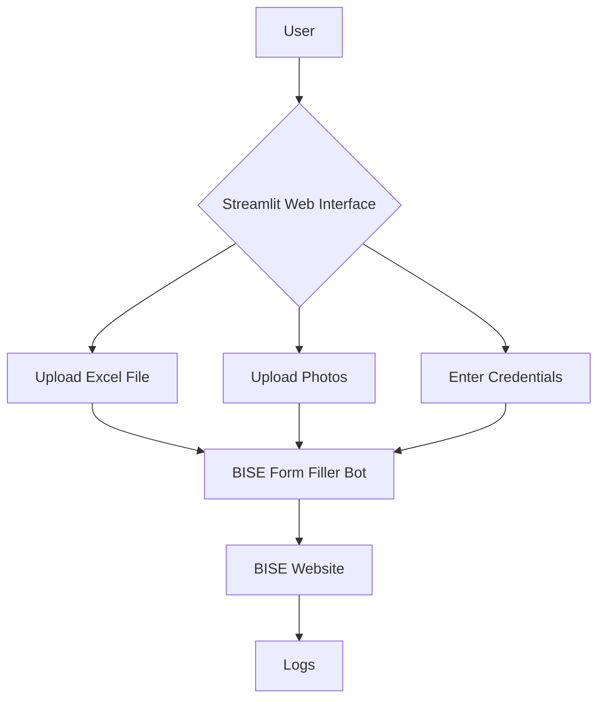
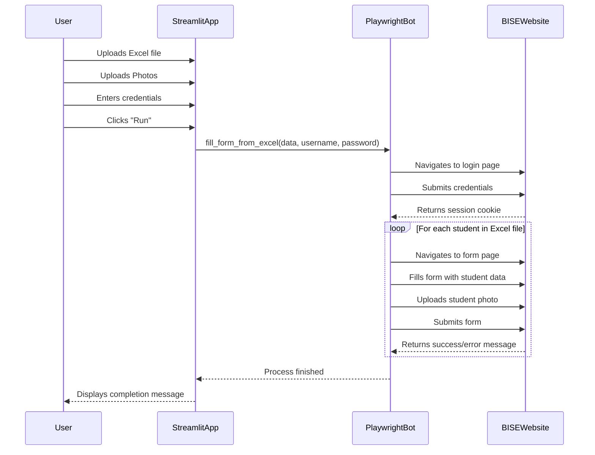
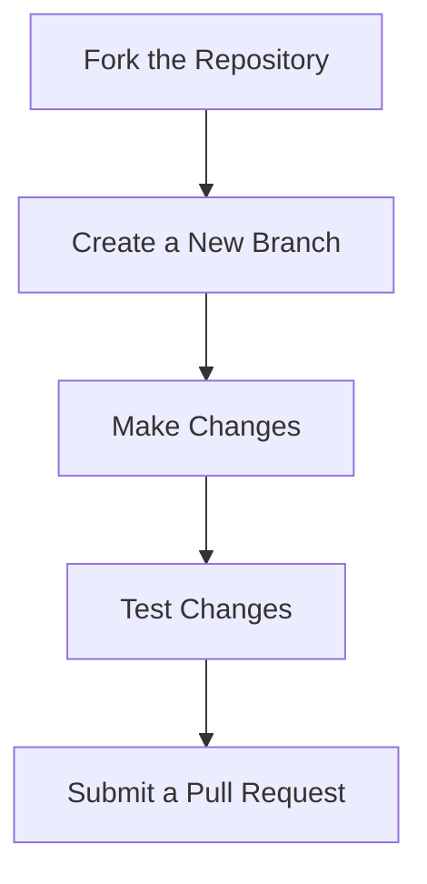

# BISE Form Filler

## Project Overview

The BISE Form Filler is a web automation tool designed to streamline the process of filling out Board of Intermediate and Secondary Education (BISE) forms. It reads student data from an Excel file, automates the data entry process on the BISE website, and uploads student photos. The application provides a user-friendly web interface built with Streamlit for easy interaction.

### Main Features

*   **Excel Data Input:** Upload an Excel file with student information.
*   **Web Automation:** Automatically fills out the BISE web form using the provided data.
*   **Image Upload:** Uploads student photos from a local directory.
*   **Error Logging:** Logs any errors encountered during the form-filling process.
*   **User-Friendly Interface:** A simple web interface for uploading files and starting the process.

## Architecture

The project is composed of two main modules: a Streamlit web interface for user interaction and a Playwright-based bot for web automation.

### Modules

*   `main.py`: The entry point for the Streamlit web application. It handles file uploads, user authentication, and initiates the form-filling process.
*   `bot.py`: Contains the core logic for browser automation. It uses Playwright to launch a browser, navigate to the BISE website, and fill in the form fields with data from the uploaded Excel file.
*   `data/template.xlsx`: An Excel template file that defines the required data structure for the student information.
*   `Photos/`: A directory where student photos, named by their GR number (e.g., `12345.jpg`), are stored.
*   `logs/`: A directory for storing log files, which are useful for debugging.

### System Architecture Diagram



### Sequence Diagram



## Installation & Setup

Follow these steps to set up the project on your local machine.

### 1. Clone the Repository

```bash
git clone https://github.com/Alph702/BISE.git
cd BISE
```

### 2. Install Dependencies

This project uses `uv` for package management. Install the required dependencies using the following command:

```bash
uv sync
```

If you don't have `uv` installed, you can install it with `pip`:

```bash
pip install uv
```

### 3. Install Playwright Browser

Playwright requires browser binaries to be installed. We use **chromium** browser. Run the following command to install them:

```bash
uv run playwright install chromium
```

## How to Run

### Development

To run the application in development mode, use the following command:

```bash
uv run streamlit run main.py
```

This will start the Streamlit server, and you can access the application in your web browser at `http://localhost:8501`.

### Production

For production deployment, it is recommended to use a production-grade web server like Gunicorn or Nginx.

## Usage Examples

1.  **Download the Template:**
    *   Open the web application.
    *   Click the "Download template" button to get the `template.xlsx` file.

2.  **Fill in the Data:**
    *   Open the downloaded `template.xlsx` file and fill in the student information.

3.  **Upload the Excel File:**
    *   In the web application, click "Choose an Excel file" and select your filled Excel file.

4.  **Upload Photos:**
    *   Create a directory named `Photos` in the project's root directory.
    *   Place the student photos in this directory, naming each file with the corresponding GR number (e.g., `12345.jpg`).
    *   In the web application, upload the `Photos` directory.

5.  **Run the Bot:**
    *   Enter your BISE username and password.
    *   Click the "Run" button to start the form-filling process.

## Extension & Contribution Guide

This project can be extended to support other forms or websites. The core logic is in `bot.py`, which can be modified to automate other tasks.

### Extension Points

*   **Adding New Form Fields:** To add a new form field, you can add a new column to the `template.xlsx` file and then update the `_fill_form_sync` function in `bot.py` to handle the new field.
*   **Supporting Different Websites:** The `_fill_form_sync` function can be adapted to work with other websites by changing the URL and the selectors used to find the form elements.

### Contribution Workflow



## Dependencies & Requirements

*   **Python:** >=3.13
*   **Libraries:**
    *   `streamlit`
    *   `pandas`
    *   `playwright`
    *   `openpyxl`
    *   `python-dotenv`

## Potential Improvements / Roadmap

*   **Headless Mode:** Add an option to run the bot in headless mode for faster execution.
*   **Multi-threading/Async:** Improve performance by using multi-threading or asynchronous operations to fill multiple forms concurrently.
*   **GUI Improvements:** Enhance the Streamlit interface with more features, such as progress bars and real-time logging.
*   **Configuration File:** Move hardcoded selectors and other configurations to a separate JSON or YAML file for easier management.